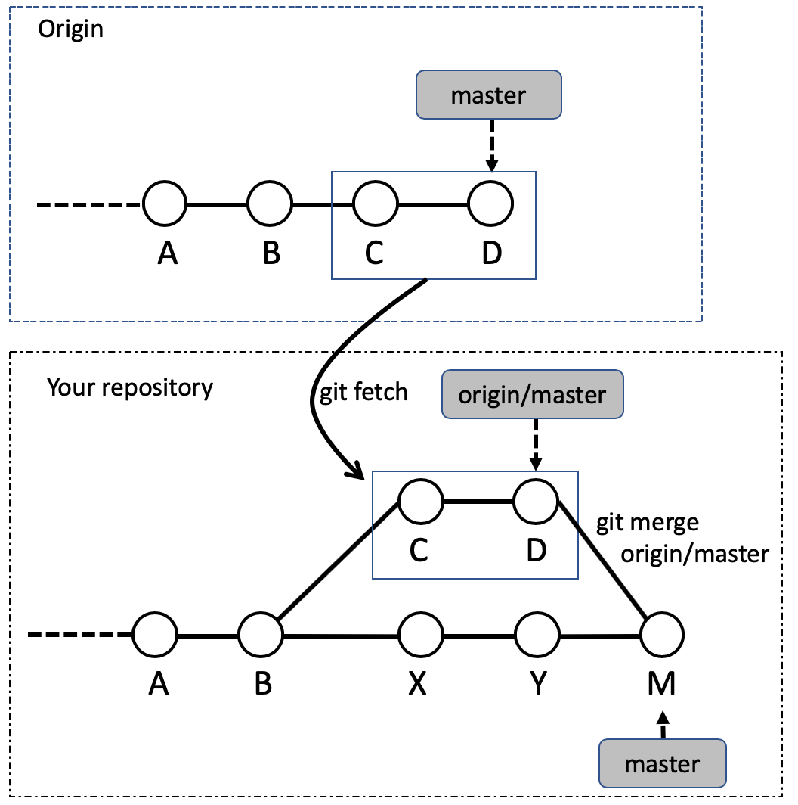

# This document explains about git architecture and git usage. 

[a documentation about markdon writing is here](./markdown.md)


## The first thing. 
**git and github is totally different thing.**   
The main architecture used in github is git.   
git is one of the version control system,  
created by *Linus Torvalds* (also the founder of Linux).  

In this document, git architecture and git usage is   
simply explaind. 

## Contents 

- the way of start up git. 
- grasp the basic git architecture. 
- make difference between git and github.


## The initial bash setting

Before starting git, it is good for you 
to add the code below to your *~/.bash_profile*  

Basic bash setting. 
```
if [ -f ~/.bashrc ]; then   
        . ~/.bashrc   
fi    

export GIT_EDITOR=vim  

export LC_ALL=en_US.UTF-8  
export LC_ALL=ja_JP.UTF-8  
```

Git branch in prompt (useful)   

* * *
parse_git_branch() {   
  git branch 2> /dev/null | sed -e '/^[^*]/d' -e 's/* \(.*\)/ (\1)/'   
}  
export PS1="\u \W\[\033[32m\]\$(parse_git_branch)\[\033[00m\] $ "  

* * * 


## the initial git setting
*Be careful, this is different from github initial setting.*   

`git init` creates *.git* directory, and initialize git. 


```
git init
git add .
git commit 
```


## Merge remote repository 

### routine work.

If you share work in remote repository, 
it is simplest (maybe not best) wasy to update your working.

```
git pull origin master   

__edit_files__
git add .
git commit -m "some comment" 

git push origin master 
```


### Case 1. 
You clone origin repository at the time of B.    
You write some program and commit twice ( X and Y ).  
Also, origin repository is edited by some other person ( C and D).    

How you can update your change into origin repository?   

   


`git fetch` (the first process of `git pull`) allows you 
to fetch repository history from origin, 
and save this into origin/master branch. 

Then, the answer is, 
```
git fetch origin master
git merge origin/master
```
or 
```
git pull origin master 
```
and after your resolve conflicts ( if exists),   
type the code below.   
```
git push origin master
```
Then you can update origin repository. 


## [test] display picture 
    
 


